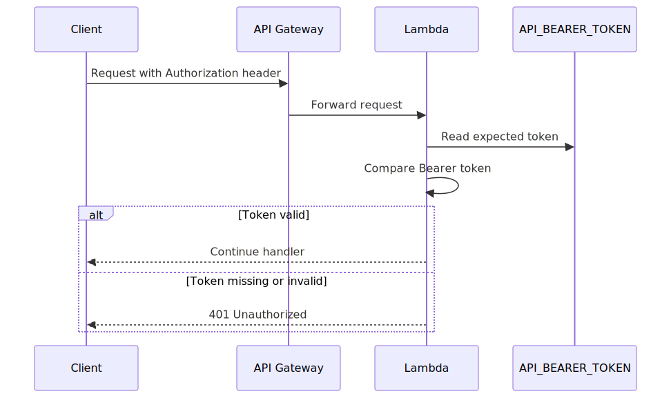

# API Documentation

## Authentication

All API endpoints require a static Bearer token.

```http
Authorization: Bearer <API_BEARER_TOKEN>
```

The expected token is configured through `.env`:

```sh
API_BEARER_TOKEN=...
```

SST passes this value into every Lambda route as the `API_BEARER_TOKEN` environment variable.



Source: [diagrams/auth-bearer.mmd](diagrams/auth-bearer.mmd)

## Routes

| Method | Path | Description |
| --- | --- | --- |
| `GET` | `/` | Health check |
| `GET` | `/events` | Poll or long-poll event stream |
| `GET` | `/stocks` | List stocks |
| `GET` | `/stocks/{symbol}` | Get one stock |
| `GET` | `/stocks/{symbol}/narrative` | Stock narrative aligned with the latest pulse snapshot |
| `GET` | `/stocks/{symbol}/movement/{interval}` | Stock movement narrative for `1h` / `4h` / `1d` / `1w` aligned with regime, pulse, predictive news, and past records |
| `GET` | `/stocks/{symbol}/narrative/{interval}` | Alias for `/stocks/{symbol}/movement/{interval}` |
| `POST` | `/stocks` | Cache-or-create one stock (idempotent) |
| `POST` | `/stocks/batch` | Cache-or-create stocks in batches |
| `GET` | `/earnings/{symbol}` | List earnings reports for a symbol (annual + quarterly) |
| `GET` | `/alerts` | List signal-alert rules |
| `GET` | `/alerts/{alertId}` | Get one signal-alert rule |
| `POST` | `/alerts` | Create a signal-alert rule |
| `DELETE` | `/alerts/{alertId}` | Delete a signal-alert rule |
| `GET` | `/pulse` | List per-region market-pulse cache rows |
| `GET` | `/pulse/{region}` | Get the pulse cache row for one region |
| `GET` | `/policy/prediction` | Politics-prediction + market-policy-impact tile payload |
| `GET` | `/positions` | List positions |
| `GET` | `/positions?accountId={accountId}` | List positions for one account |
| `GET` | `/positions/{accountId}/{symbol}` | Get one position |
| `POST` | `/positions` | Upsert one position |

## Signals and the stock cache

`POST /stocks` writes through a DynamoDB cache and emits the `STCO_NEW_ADDED` signal only on first insert. Repeat posts for the same `symbol` return the cached row (including its original `executedActions`) without re-writing or re-emitting. Each response carries a `subscribe` block clients can follow to long-poll the resulting event.

On first insert the same request also emits `STCO_PROCESS_STOCK` and asynchronously invokes the `ProcessStock` Lambda, which backfills all annual and quarterly earnings reports from Financial Modeling Prep into the `Earnings` table. The stock row carries `processingState`, transitioning `being_processed` → `data_pulled` (or `process_failed`) and emitting `STCO_DATA_PULLED` / `STCO_PROCESS_FAILED` on completion.

In addition, the `PullPrices` EventBridge cron refreshes `price`, `dailyChange`, and `dailyChangePercent` on every stock row every 30 seconds (1-minute schedule, two passes per invocation).

See [signals.md](./signals.md) for the full signal catalog, cache semantics, processing-state lifecycle, and the earnings/price stores.

## Example

```sh
curl -X POST "$API_URL/stocks" \
  -H "Authorization: Bearer $API_BEARER_TOKEN" \
  -H "content-type: application/json" \
  -d '{
    "symbol": "AAPL",
    "name": "Apple Inc."
  }'
```

Example response for a newly inserted stock:

```json
{
  "stock": {
    "symbol": "AAPL",
    "name": "Apple Inc.",
    "createdAt": "2026-05-08T10:00:00.000Z",
    "updatedAt": "2026-05-08T10:00:00.000Z",
    "processingState": "being_processed",
    "executedActions": [
      {
        "action": "STCO_NEW_ADDED",
        "symbol": "AAPL",
        "eventId": "2026-05-08T10:00:00.000Z#3f14fd5a-bd07-45d1-a5f9-b49363f5d305"
      },
      {
        "action": "STCO_PROCESS_STOCK",
        "symbol": "AAPL",
        "eventId": "2026-05-08T10:00:00.001Z#11ee1e1e-aaaa-bbbb-cccc-dddddddddddd"
      }
    ]
  },
  "executedActions": [
    {
      "action": "STCO_NEW_ADDED",
      "symbol": "AAPL",
      "eventId": "2026-05-08T10:00:00.000Z#3f14fd5a-bd07-45d1-a5f9-b49363f5d305"
    },
    {
      "action": "STCO_PROCESS_STOCK",
      "symbol": "AAPL",
      "eventId": "2026-05-08T10:00:00.001Z#11ee1e1e-aaaa-bbbb-cccc-dddddddddddd"
    }
  ],
  "subscribe": {
    "method": "long-poll",
    "pollUrl": "/events?from=2026-05-08T10%3A00%3A00.000Z%233f14fd5a-bd07-45d1-a5f9-b49363f5d305&waitSeconds=25",
    "waitSeconds": 25,
    "eventIds": [
      "2026-05-08T10:00:00.000Z#3f14fd5a-bd07-45d1-a5f9-b49363f5d305",
      "2026-05-08T10:00:00.001Z#11ee1e1e-aaaa-bbbb-cccc-dddddddddddd"
    ]
  },
  "cached": false
}
```

Subscribing to the `subscribe.pollUrl` will additionally deliver `STCO_DATA_PULLED` (or `STCO_PROCESS_FAILED`) once the `ProcessStock` Lambda completes the earnings backfill.

## Earnings

`GET /earnings/{symbol}` returns every earnings row stored for the symbol, most-recent first. Optional `kind=ANNUAL` or `kind=QUARTER` filters by report type.

```sh
curl "$API_URL/earnings/AAPL?kind=QUARTER" \
  -H "Authorization: Bearer $API_BEARER_TOKEN"
```

Example response:

```json
{
  "symbol": "AAPL",
  "count": 1,
  "reports": [
    {
      "symbol": "AAPL",
      "period": "QUARTER#2026-03-29",
      "reportDate": "2026-03-29",
      "fiscalPeriod": "Q2",
      "calendarYear": "2026",
      "reportedCurrency": "USD",
      "revenue": 90753000000,
      "grossProfit": 42434000000,
      "operatingIncome": 28611000000,
      "netIncome": 23636000000,
      "eps": 1.54,
      "epsDiluted": 1.53,
      "source": "fmp",
      "fetchedAt": "2026-05-11T08:32:10.481Z",
      "analysis": {
        "grossMargin": 0.432,
        "operatingMargin": 0.315,
        "netMargin": 0.247,
        "freeCashFlow": 28611000000,
        "operatingCashFlow": 31200000000,
        "capitalExpenditure": -2589000000,
        "fcfMargin": 0.315,
        "fcfConversion": 1.211,
        "revenueGrowth": 0.049,
        "netIncomeGrowth": 0.052,
        "epsGrowth": 0.061,
        "grossMarginDelta": 0.011,
        "operatingMarginDelta": 0.014,
        "narrative": "Revenue up 4.9% YoY; operating margin expanding to 31.5%, FCF conversion strong at 121.1%, EPS +6.1% YoY."
      },
      "raw": { "income": { "...": "..." }, "cashFlow": { "...": "..." } }
    }
  ]
}
```

Each row carries an `analysis` block with margins (gross/operating/net), free-cash-flow metrics (FCF, operating CF, capex, FCF margin, FCF conversion), period-over-period growth/deltas, and a one-sentence deterministic narrative. The latest of these is also denormalised onto the `Stocks` row under `latestEarningsAnalysis`. See [`signals.md`](./signals.md#fundamentals-pipeline) for the full schema.

## MACD

Each `Stocks` row carries a `macd` field with readings for `5m`, `20m`, `30m`, `1h`, `2h`, `4h`, `1d`, `1w`. Read it via `GET /stocks/{symbol}`:

```json
{
  "stock": {
    "symbol": "AAPL",
    "macd": {
      "5m":  { "macd": 0.21, "signal": 0.18, "histogram": 0.03, "previousHistogram": 0.01, "quality": "bullish",        "asOf": "2026-05-11 09:00:00", "sampleSize": 312 },
      "20m": { "macd": 0.18, "signal": 0.17, "histogram": 0.01, "previousHistogram": 0.02, "quality": "neutral_bullish","asOf": "2026-05-11 09:00:00", "sampleSize": 78 },
      "30m": { "...": "..." },
      "1h":  { "...": "..." },
      "2h":  { "...": "..." },
      "4h":  { "...": "..." },
      "1d":  { "...": "..." },
      "1w":  { "...": "..." }
    },
    "macdUpdatedAt": "2026-05-11T09:00:01.221Z"
  }
}
```

Readings are computed (a) on stock entry by `ProcessStock` and (b) every 15 minutes by the `PullMacd` cron. See [`signals.md`](./signals.md#macd-pipeline) for the timeframe sourcing, aggregation rules, and quality categories.

## Market pulse

Per-region cache populated by the `PullPulse` cron every 20 minutes from the FMP news feed. Each row carries a status band (`calm` / `watch` / `elevated` / `critical`), criticality + severity scores, the top themes, and the source article links. Regions with no fresh news for 4+ hours are flagged `stale: true`.

```sh
curl "$API_URL/pulse" -H "Authorization: Bearer $API_BEARER_TOKEN"
curl "$API_URL/pulse/Middle%20East" -H "Authorization: Bearer $API_BEARER_TOKEN"
```

See [`signals.md`](./signals.md#market-pulse) for the row shape, theme dictionary, and the `PULSE_REGION_UPDATED` / `PULSE_REGION_STALE` signals.

## Signal alerts

Create a signal-alert rule:

```sh
curl -X POST "$API_URL/alerts" \
  -H "Authorization: Bearer $API_BEARER_TOKEN" \
  -H "content-type: application/json" \
  -d '{
    "name": "AAPL gap up > 2% premarket",
    "sessions": ["premarket"],
    "scope": { "symbols": ["AAPL"] },
    "condition": { "kind": "TBD" }
  }'
```

- `sessions` must be a non-empty subset of `["premarket", "regular", "afterhours"]`. The `EvaluateAlerts` cron runs every 30 minutes and only evaluates rules whose `sessions` include the current US market session.
- `condition` is intentionally typed as free-form `unknown` for now. The rule grammar is yet to be defined; the evaluator currently treats every rule as a stub (no match) until rule kinds are introduced.
- Set `enabled: false` to keep a rule in the table but stop evaluating it.

See [`signals.md`](./signals.md#signal-alerts) for the session windows, `SIGN_ALERT_RAISED` payload, and the `SIGN_ALERT_TICK_SKIPPED` heartbeat fired when the cron runs outside market hours.

## Real-time prices

The `PullPrices` EventBridge cron runs every minute and performs two FMP `/quote` passes per invocation (30 seconds apart), giving an effective 30-second refresh cadence. Each pass updates the following fields on the matching `Stocks` row:

```
price, dailyChange, dailyChangePercent,
dayLow, dayHigh, openPrice, previousClose,
lastVolume, priceUpdatedAt
```

Read the latest price via `GET /stocks/{symbol}`.

## Event Polling

Use `GET /events` to read events. Keep the returned `nextCursor` and pass it as `after` on the next request.

Query parameters:

| Name | Description |
| --- | --- |
| `after` | Optional **exclusive** cursor. Returns events with `eventId > after`. Mutually exclusive with `from`. |
| `from` | Optional **inclusive** cursor. Returns events with `eventId >= from`. Use this with the eventId returned by a POST to receive that event on the first poll. |
| `limit` | Optional page size from 1 to 100. Defaults to 100. |
| `waitSeconds` | Optional long-poll wait time from 0 to 25 seconds. Defaults to 0. |

Startup poll:

```sh
curl "$API_URL/events?limit=100" \
  -H "Authorization: Bearer $API_BEARER_TOKEN"
```

Long-poll for new events:

```sh
curl "$API_URL/events?after=$NEXT_CURSOR&waitSeconds=25" \
  -H "Authorization: Bearer $API_BEARER_TOKEN"
```

Example response:

```json
{
  "count": 1,
  "events": [
    {
      "eventId": "2026-05-08T10:00:00.000Z#3f14fd5a-bd07-45d1-a5f9-b49363f5d305",
      "type": "STCO_NEW_ADDED",
      "payload": {
        "action": "STCO_NEW_ADDED",
        "symbol": "AAPL"
      },
      "createdAt": "2026-05-08T10:00:00.000Z"
    }
  ],
  "nextCursor": "2026-05-08T10:00:00.000Z#3f14fd5a-bd07-45d1-a5f9-b49363f5d305",
  "polling": {
    "waitSeconds": 25,
    "limit": 100
  }
}
```

## Stock movement narrative

`GET /stocks/{symbol}/movement/{interval}` (alias: `/stocks/{symbol}/narrative/{interval}`) returns a movement narrative for the stock over a windowed interval. Supported intervals: `1h`, `4h`, `1d`, `1w`.

Each interval maps to a regime scale and a pulse-history lookback:

| Interval | Regime scale | Movement reference | Pulse window |
| --- | --- | --- | --- |
| `1h` | `intraday` | session-to-date intraday change | last 1h of pulse snapshots |
| `4h` | `intraday` | session-to-date intraday change | last 4h of pulse snapshots |
| `1d` | `daily` | latest close vs prior trading-day close | last 24h of pulse snapshots |
| `1w` | `weekly` | latest close vs close ~5 trading days back | last 7d of pulse snapshots |

```sh
curl "$API_URL/stocks/AAPL/movement/1d" \
  -H "Authorization: Bearer $API_BEARER_TOKEN"
```

The response contains:

- `movement` — `referencePrice`, `currentPrice`, `changePct`, `direction`, `referenceSource` (`open` / `previous-close` / `historical-close` / `intraday-change`), and a `bars[]` time-series for the window.
- `regime` — the latest `MarketRegime` row at the matching scale (`classification`, `score`, `topThemes`, `summary`).
- `pulse` — the latest snapshot's `overallStatus` / `overallScore` / `riskState` / `hotRegions` / VIX, plus `inWindowSnapshots` count and `inWindowThemes[]` aggregated across snapshots that fall inside the window.
- `alignment` — latest `MarketAlignment` composite (`riskLevel`, `bias`, `biasScore`, `pulseRiskScore`, `hotRegions`) and an `interpretation` (`with-tape` / `against-tape` / `neutral` / `no-data`) comparing the stock's direction against the composite bias.
- `predictiveNews` — `themes[]` (weighted by region severity + criticality, each tagged `negative` / `neutral` / `positive`), `headlines[]` (most recent pulse links in window), `netSentiment`, and `expectedBias` (`up` / `down` / `neutral`) with a one-line `rationale`.
- `pastRecords` — recent `MarketAlignment` and matching-scale `MarketRegime` rows, plus `priorWindowChangePct` for the same stock one window back, plus the stock's stored `returns` vector.
- `drivers[]` — short bullet drivers.
- `summary` — single-sentence narrative.

## Policy prediction

`GET /policy/prediction` returns a single payload that hydrates the **Politics Prediction** tile and the **Market Policy Impact** tile. It is derived from the latest `MarketPulseSnapshot` (overall + per-region scores + headlines), the previous snapshot (to compute region trend), and the latest `MarketAlignment` (composite risk/bias).

```sh
curl "$API_URL/policy/prediction" \
  -H "Authorization: Bearer $API_BEARER_TOKEN"
```

Response shape:

- `globalRisk` — `level` (`CALM` / `WATCH` / `ELEVATED` / `CRITICAL`), `score`, `narrative`, and per-region chips (`name`, `status`, `trend`).
- `regions[]` — covers USA, Iran, China, Europe, India, Asia. Each card carries `status` (`LOW` / `MEDIUM` / `HIGH` / `CRITICAL`), `trend` (`escalating` / `stable` / `easing` — computed against the previous snapshot), `title` (top headline), `narrative` (region summary), `prediction` (derived from themes + trend), and `sourceHeadlines[]` (up to 5).
- `marketImpact` — `magnitude` (`MINOR` / `MODERATE` / `SIGNIFICANT` / `EXTREME`), `stance` (`RISK-ON` / `RISK-OFF` / `NEUTRAL`), `title`, `narrative` (composite bias + VIX context), `themes[]` (each with `signal` of negative/neutral/positive and an affected `sectors[]` list), `sectorsToWatch[]`, and `sourceHeadlines[]` (top 10 across regions sorted by `publishedAt`).

The cadence follows the `PullPulse` cron (every 15 minutes; every 5 in `sst dev`).
