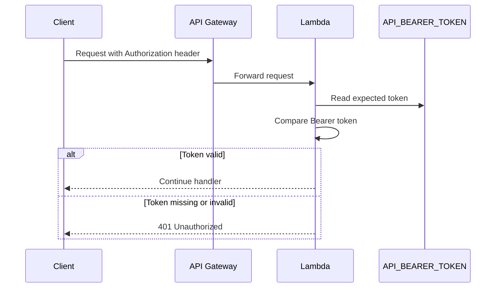

# API Documentation

## Authentication

All API endpoints require a static Bearer token.

```http
Authorization: Bearer <API_BEARER_TOKEN>
```

The expected token is configured through `.env`:

```sh
API_BEARER_TOKEN=...
```

SST passes this value into every Lambda route as the `API_BEARER_TOKEN` environment variable.



## Routes

| Method | Path | Description |
| --- | --- | --- |
| `GET` | `/` | Health check |
| `GET` | `/events` | Poll or long-poll event stream |
| `GET` | `/stocks` | List stocks |
| `GET` | `/stocks/{symbol}` | Get one stock |
| `POST` | `/stocks` | Cache-or-create one stock (idempotent) |
| `POST` | `/stocks/batch` | Cache-or-create stocks in batches |
| `GET` | `/positions` | List positions |
| `GET` | `/positions?accountId={accountId}` | List positions for one account |
| `GET` | `/positions/{accountId}/{symbol}` | Get one position |
| `POST` | `/positions` | Upsert one position |

## Signals and the stock cache

`POST /stocks` writes through a DynamoDB cache and emits the `STCO_NEW_ADDED` signal only on first insert. Repeat posts for the same `symbol` return the cached row (including its original `executedActions`) without re-writing or re-emitting. Each response carries a `subscribe` block clients can follow to long-poll the resulting event.

See [signals.md](./signals.md) for the full signal catalog, cache semantics, and sequence diagrams.

## Example

```sh
curl -X POST "$API_URL/stocks" \
  -H "Authorization: Bearer $API_BEARER_TOKEN" \
  -H "content-type: application/json" \
  -d '{
    "symbol": "AAPL",
    "name": "Apple Inc."
  }'
```

Example response for a newly inserted stock:

```json
{
  "stock": {
    "symbol": "AAPL",
    "name": "Apple Inc.",
    "createdAt": "2026-05-08T10:00:00.000Z",
    "updatedAt": "2026-05-08T10:00:00.000Z",
    "executedActions": [
      {
        "action": "STCO_NEW_ADDED",
        "symbol": "AAPL",
        "eventId": "2026-05-08T10:00:00.000Z#3f14fd5a-bd07-45d1-a5f9-b49363f5d305"
      }
    ]
  },
  "executedActions": [
    {
      "action": "STCO_NEW_ADDED",
      "symbol": "AAPL",
      "eventId": "2026-05-08T10:00:00.000Z#3f14fd5a-bd07-45d1-a5f9-b49363f5d305"
    }
  ],
  "subscribe": {
    "method": "long-poll",
    "pollUrl": "/events?from=2026-05-08T10%3A00%3A00.000Z%233f14fd5a-bd07-45d1-a5f9-b49363f5d305&waitSeconds=25",
    "waitSeconds": 25,
    "eventIds": ["2026-05-08T10:00:00.000Z#3f14fd5a-bd07-45d1-a5f9-b49363f5d305"]
  },
  "cached": false
}
```

## Event Polling

Use `GET /events` to read events. Keep the returned `nextCursor` and pass it as `after` on the next request.

Query parameters:

| Name | Description |
| --- | --- |
| `after` | Optional **exclusive** cursor. Returns events with `eventId > after`. Mutually exclusive with `from`. |
| `from` | Optional **inclusive** cursor. Returns events with `eventId >= from`. Use this with the eventId returned by a POST to receive that event on the first poll. |
| `limit` | Optional page size from 1 to 100. Defaults to 100. |
| `waitSeconds` | Optional long-poll wait time from 0 to 25 seconds. Defaults to 0. |

Startup poll:

```sh
curl "$API_URL/events?limit=100" \
  -H "Authorization: Bearer $API_BEARER_TOKEN"
```

Long-poll for new events:

```sh
curl "$API_URL/events?after=$NEXT_CURSOR&waitSeconds=25" \
  -H "Authorization: Bearer $API_BEARER_TOKEN"
```

Example response:

```json
{
  "count": 1,
  "events": [
    {
      "eventId": "2026-05-08T10:00:00.000Z#3f14fd5a-bd07-45d1-a5f9-b49363f5d305",
      "type": "STCO_NEW_ADDED",
      "payload": {
        "action": "STCO_NEW_ADDED",
        "symbol": "AAPL"
      },
      "createdAt": "2026-05-08T10:00:00.000Z"
    }
  ],
  "nextCursor": "2026-05-08T10:00:00.000Z#3f14fd5a-bd07-45d1-a5f9-b49363f5d305",
  "polling": {
    "waitSeconds": 25,
    "limit": 100
  }
}
```
