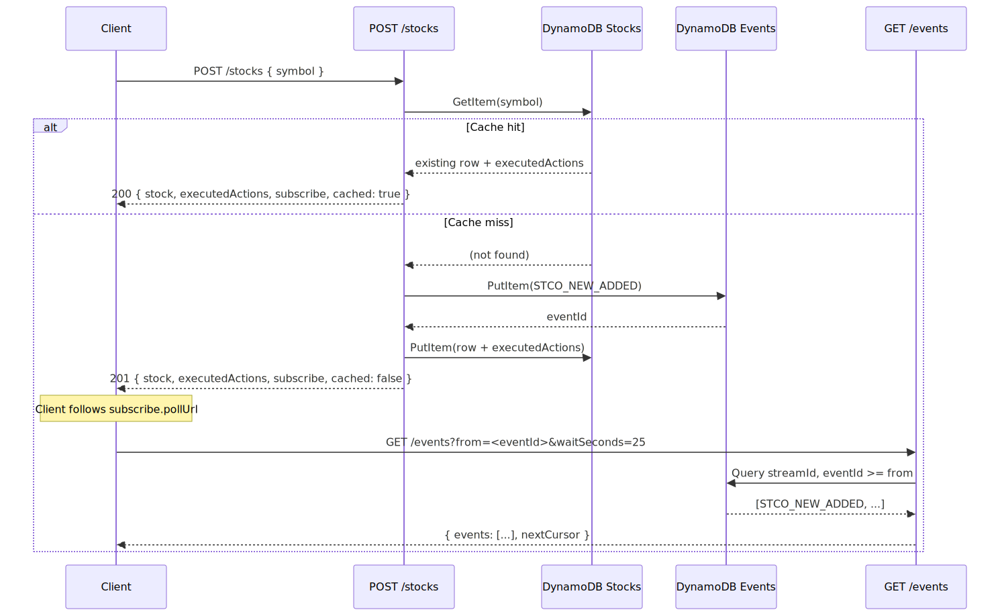
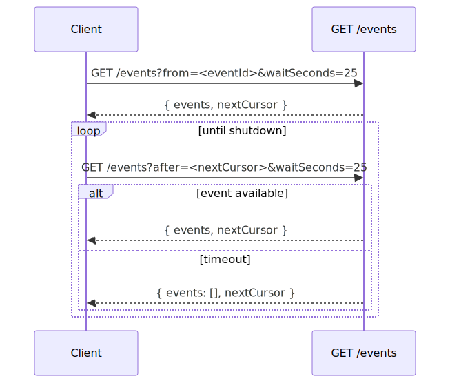

# Signals

A **signal** is a named action that the control plane emits when a domain state transition occurs. Each emission is persisted as an event on the global event stream and made available to clients through long-poll subscriptions.

Signals are fire-and-record: the emitting handler writes the event row synchronously before responding to the caller, so the eventId returned in the API response is guaranteed to be readable through `GET /events` immediately.

## Catalog

| Signal | Emitted by | Trigger | Payload |
| --- | --- | --- | --- |
| `STCO_NEW_ADDED` | `POST /stocks`, `POST /stocks/batch` | First time a `symbol` is written to the `Stocks` cache table | `{ action: "STCO_NEW_ADDED", symbol }` |

### `STCO_NEW_ADDED`

Fired when a stock symbol is inserted for the first time. Re-posting the same symbol does **not** re-emit the signal — the cached record (including the `executedActions` from the original insert) is returned instead.

The eventId of the emission is persisted on the stock row under `executedActions` and is also returned in the POST response so a client that just inserted the stock can immediately subscribe and receive its own emission.

## Stock POST cache semantics

`POST /stocks` is idempotent and behaves as a write-through cache keyed by `symbol`:

- **Cache miss** (symbol not present) → write row, emit `STCO_NEW_ADDED`, return `201` with the new row, the executed actions, and a `subscribe` block pointing at the event stream.
- **Cache hit** (symbol already present) → return `200` with the cached row and the executed actions that were recorded on the original insert. No write, no re-emission.



Source: [diagrams/stock-post-flow.mmd](diagrams/stock-post-flow.mmd)

## Subscribing to signals

Every POST response that emitted or recorded a signal carries a `subscribe` block:

```json
{
  "subscribe": {
    "method": "long-poll",
    "pollUrl": "/events?from=2026-05-10T12:00:00.000Z%23<uuid>&waitSeconds=25",
    "waitSeconds": 25,
    "eventIds": ["2026-05-10T12:00:00.000Z#<uuid>"]
  }
}
```

The client follows `pollUrl` to read the emitted event(s). The `from` cursor is **inclusive**, so the first long-poll call returns the event the POST just emitted.

### Why long-poll instead of SSE

API Gateway HTTP API does not stream responses to clients, so a true Server-Sent Events stream cannot be served from this stack without changing the ingress (Lambda function URLs with response streaming, ALB, or WebSocket API). Long-polling against `/events` provides the same effective semantics — the connection stays open up to `waitSeconds=25`, returns as soon as a matching event lands, and the client immediately re-issues the request with the new `nextCursor`.

### Polling loop



Source: [diagrams/polling-loop.mmd](diagrams/polling-loop.mmd)

## Cursor parameters

| Param | Semantics | When to use |
| --- | --- | --- |
| `from` | Inclusive — returns events with `eventId >= from` | First call after a POST, when you want the event you just emitted |
| `after` | Exclusive — returns events with `eventId > after` | Subsequent polls, using the previous `nextCursor` |

`from` and `after` are mutually exclusive in a single request.
